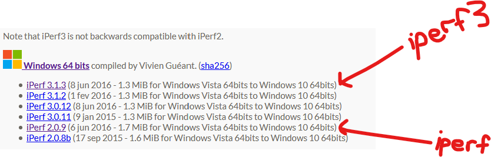

# iperf
A collection of references because I always have to look them up.

### Important Notes:
- You must using the same iperf code base on both the client and the server
- Server must be running first!
- Default Operation: Client pushes traffic to Server over TCP (simulated upload)
- Simulate Download: Use the `-R` flag on the Client for '*reverse*'

## Download
For both `iperf` & `iperf3`:
- [https://iperf.fr/iperf-download.php](https://iperf.fr/iperf-download.php)



Most linux package managers have iperf & iperf3 in their inventory.

**WARNING:** Make sure to note the package name. There is a big code base difference from `iperf` to `iperf3`.

## Using `iperf3`
#### Server:
```
iperf3 -s -D
```
- `-s`      Start iperf3 as the server
- `-D`      Start iperf3 as a daemon in the background

#### Client:
```
iperf3 -c xxx.xxx.xxx.xxx -P 8 -t 60
```
- `-P <#>`    Number of parallel threads
- `-t <##>`   Time: duration in seconds. Default is 10.

### `iperf3`: Additional Client Flags Worth Noting
- `-u`      Use UDP
- `-R`      Reverse: invoked from the client tells the Server to Send data to the client, simulating a download

### Public `iperf3` Servers:
[https://iperf.fr/iperf-servers.php](https://iperf.fr/iperf-servers.php)
- iperf.scottlinux.com
```
iperf3 -c iperf.scottlinux.com -P 8 -t 60
```
- iperf.he.net
```
iperf3 -c iperf.he.net -P 8 -t 60
```

## Using `iperf`
#### Server:
```
iperf -s -D
```
- `-s`      Start iperf as the server
- `-D`      Start iperf as a daemon in the background

#### Client:
```
iperf -c xxx.xxx.xxx.xxx -P 8 -t 60 -i 2
```  
- `-c <x...>` Start iperf as a Client and connect to the Server: <xxx.xxx.xxx.xxx>
- `-P <#>`    Parallel threads
- `-t <##>`   Time: duration in seconds. Default is 10.
- `-i <#>`    Update console with current summary every [#] seconds.


### `iperf`: Additional Client Flags Worth Noting
- `-u`      Use UDP
- `-d`      Bi-directional Testing (iperf ONLY, NOT iperf3)

